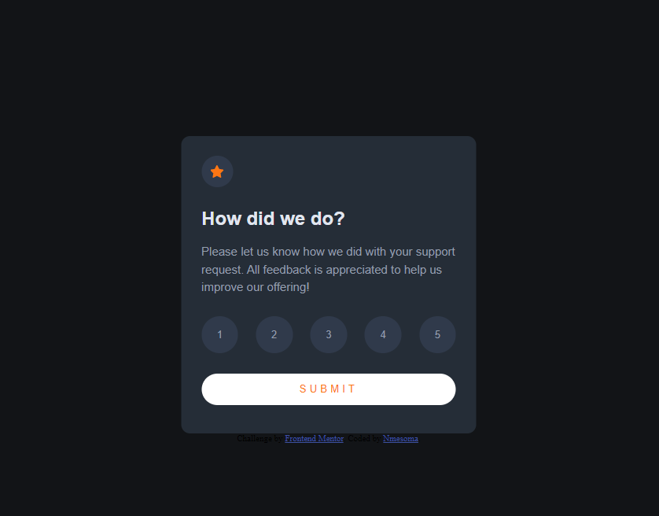
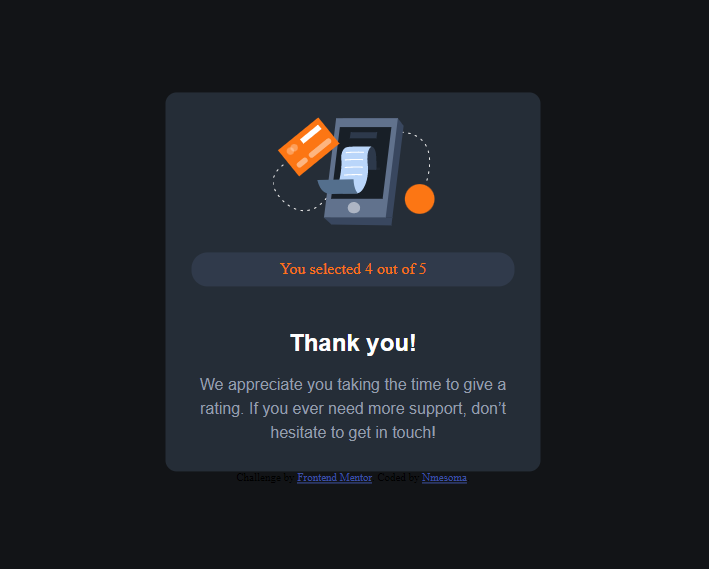

# Frontend Mentor - Interactive rating component solution

This is a solution to the [Interactive rating component challenge on Frontend Mentor](https://www.frontendmentor.io/challenges/interactive-rating-component-koxpeBUmI). Frontend Mentor challenges help you improve your coding skills by building realistic projects. 

## Table of contents

- [Overview](#overview)
  - [The challenge](#the-challenge)
  - [Screenshot](#screenshot)
  - [Links](#links)
- [My process](#my-process)
  - [Built with](#built-with)
  - [What I learned](#what-i-learned)
  - [Continued development](#continued-development)
  - [Useful resources](#useful-resources)
- [Author](#author)
- [Acknowledgments](#acknowledgments)

## Overview
This is a rating page, where users can rate a number out of 5, then on submission the rating given is shown on a thank you page.

### The challenge

Users should be able to:

- View the optimal layout for the app depending on their device's screen size
- See hover states for all interactive elements on the page
- Select and submit a number rating
- See the "Thank you" card state after submitting a rating

### Screenshot




### Links

- Solution URL: [Code](https://github.com/Maysummer/interactive-rating)
- Live Site URL: [Live](https://maysummer.github.io/interactive-rating/)

### Built with

- Semantic HTML5 markup
- CSS custom properties
- Flexbox
- Mobile-first workflow
- JavaScript 

### What I learned

- HTML DOM
- Event listeners
- HTML body alignment

```css
.container {
    position: absolute;
    top: 50%;
    left: 50%;
    transform: translate(-50%, -50%);
}
```

### Continued development

- HTML DOM
- EVent listeners
- JavaScript

## Author

- Frontend Mentor - [@Maysummer](https://www.frontendmentor.io/profile/Maysummer)

## Acknowledgments

- Anuoluwapo
- David
- Chidalu
